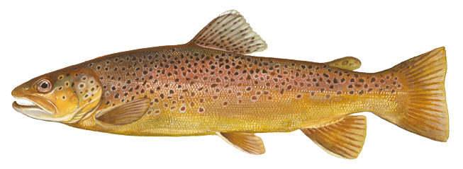
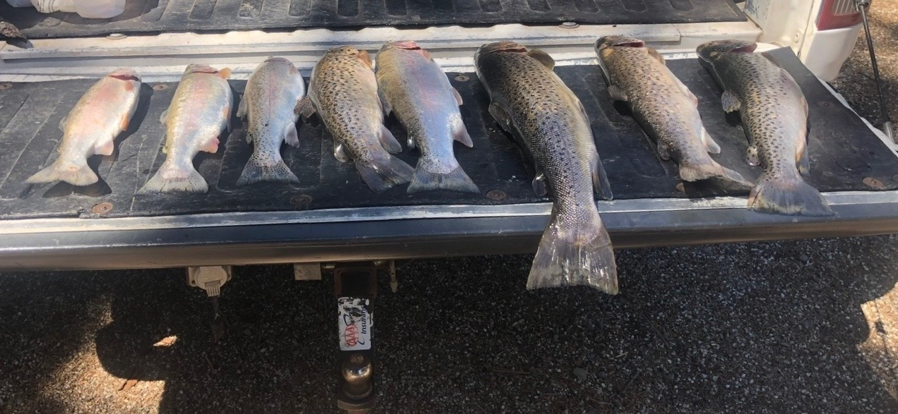

```{=html}
<style>

/* ======================================================
   Brown Trout Report Theme
   Brown, cream, taupe, and copper palette
====================================================== */


/* ======================================================
   PAGE AND MAIN CONTENT
====================================================== */

html,
body,
#quarto-content,
.page-columns,
main,
main.content,
.content {
  background: #ffffff !important;
}

body {
  color: #332f2b;
  line-height: 1.75;
}

/* Make the report body wide */

main.content {
  max-width: none !important;
  width: 100% !important;
  padding-left: 2.5rem !important;
  padding-right: 2.5rem !important;
}

/* Remove unused right margin */

.margin-sidebar,
.column-margin {
  display: none !important;
}


/* ======================================================
   LEFT SIDEBAR
====================================================== */

/* Move the sidebar farther left */

#quarto-sidebar,
.sidebar,
.sidebar-navigation {
  margin-left: -3rem !important;
  padding-left: 1.4rem !important;
  padding-right: 1rem !important;
}

/* Reduce gap between sidebar and report */

.page-columns {
  gap: 0 !important;
}

/* Brown sidebar background */

#quarto-sidebar,
.sidebar,
.sidebar-navigation,
nav[role="doc-toc"] {
  background: #6b513f !important;
}

/* TOC container */

#TOC {
  background: transparent !important;
}

/* TOC title */

#TOC .toc-title {
  color: #fff8ed !important;
  font-size: 1.05rem;
  font-weight: 700;
  margin-bottom: 0.9rem;
}

/* Normal TOC links */

#TOC a,
#TOC a:visited {
  color: #eee2cf !important;
  text-decoration: none;
  transition:
    color 0.2s ease,
    background-color 0.2s ease;
}

/* Hovered TOC link */

#TOC a:hover {
  color: #fff5e3 !important;
}

/* Active TOC section */

#TOC .active,
#TOC a.active {
  color: #e3bd78 !important;
  font-weight: 700;
}

/* TOC section numbers */

#TOC .header-section-number {
  color: #d4c1a5 !important;
}

/* Remove Quarto's default TOC border */

nav[role="doc-toc"] {
  border-left: none !important;
}

/* Sidebar scrollbar */

#quarto-sidebar::-webkit-scrollbar {
  width: 8px;
}

#quarto-sidebar::-webkit-scrollbar-track {
  background: #6b513f;
}

#quarto-sidebar::-webkit-scrollbar-thumb {
  background: #92745d;
  border-radius: 4px;
}


/* ======================================================
   REPORT TITLE AND HEADINGS
====================================================== */

.quarto-title-block .title,
h1 {
  color: #5d2f24 !important;
}

h2 {
  color: #784633 !important;
}

h3 {
  color: #9a6547 !important;
}

h1,
h2,
h3 {
  font-weight: 700;
  margin-top: 1.5em;
  margin-bottom: 0.6em;
}

/* Section numbers in the report */

.header-section-number {
  color: #9d8878;
}


/* ======================================================
   PARAGRAPHS
====================================================== */

p {
  text-align: justify;
  margin-bottom: 1.2rem;
}


/* ======================================================
   LINKS
====================================================== */

main a,
main a:visited {
  color: #7a4934 !important;
  text-decoration: none;
}

main a:hover {
  color: #b06a3b !important;
  text-decoration: underline;
}


/* ======================================================
   CODE
====================================================== */

code {
  background: #f4eee6 !important;
  color: #5d3428 !important;
  border-radius: 4px;
  padding: 0.15em 0.35em;
}

pre,
.sourceCode,
div.sourceCode {
  background: #faf7f2 !important;
  border-left: 5px solid #9b7458 !important;
  border-radius: 8px;
}

/* Code-fold and code-copy controls */

.code-fold-btn,
.code-tools-button,
details summary {
  color: #7a4934 !important;
}


/* ======================================================
   TABLES
====================================================== */

table {
  width: 100%;
  border-collapse: collapse;
  margin-top: 1.5rem;
  margin-bottom: 1.5rem;
}

table th {
  background: #705441 !important;
  color: #fff8ed !important;
  font-weight: 700;
}

table th,
table td {
  border: 1px solid #d8cbbb;
  padding: 0.75rem;
}

table tr:nth-child(even) {
  background: #f7f2eb;
}

table tr:hover {
  background: #eee3d6;
}


/* ======================================================
   BLOCKQUOTES
====================================================== */

blockquote {
  background: #f8f2e9;
  border-left: 5px solid #a36b43;
  color: #4a3c33;
  padding: 1rem 1.4rem;
  border-radius: 6px;
  font-style: italic;
}


/* ======================================================
   FIGURES AND CAPTIONS
====================================================== */

img {
  max-width: 100%;
  height: auto;
  border-radius: 8px;
}

figcaption,
.figure-caption {
  color: #75685f;
  font-style: italic;
}


/* ======================================================
   HORIZONTAL LINES
====================================================== */

hr {
  border: none;
  height: 2px;
  background: linear-gradient(
    to right,
    #5d2f24,
    #c49a65,
    #5d2f24
  );
  margin-top: 2rem;
  margin-bottom: 2rem;
}


/* ======================================================
   TEXT SELECTION
====================================================== */

::selection {
  background: #ead7bd;
  color: #3d2c24;
}


/* ======================================================
   NAVBAR
====================================================== */

/* Keep the main website navbar dark green */

.navbar {
  background: #0f4a3a !important;
}

.navbar-brand,
.navbar-title,
.navbar-nav .nav-link {
  color: #ffffff !important;
}

</style>
```

# Loading libraries

```{r}
#| Label: Loading libraries
#install.packages("GGally")
library(tidyverse)  # Collection of tools for cleaning, organizing, and visualizing data.
library(dplyr)      # Used to filter, sort, and summarize the data.
library(ggplot2)    # Used to create graphs and data visualizations.
library(cowplot)    # Used to improve the appearance of plots and combine multiple graphs into one figure.
library(GGally)     # Used to create pairwise plots and quickly explore relationships between variables.
library(tibble) # modern dataframe
#install.packages("gt")
library(gt) # for pretty table
library(tidymodels) # for dimension reduction
library(embed) #extra preprocessing steps for the recipes package to convert high-cardinality categorical variables and complex predictors into numeric embeddings using outcome data
library(ggrepel) # to repel PCA labels
library(patchwork) #combine multiple ggplot2 graphs into one
library(dbscan)
```

# Introduction

My husband, Tristan, loves fishing and often travels to California in search of trophy fish. After one trip, he confidently claimed that he had caught the biggest brown tout, but the exact location of his catch remains a closely guarded fishing secret.

Inspired by his story, I found a publicly available dataset containing individual brown trout measurements, environmental variables, and sampling locations from across California.

[](https://wildlife.ca.gov/Fishing/Inland/Brown-Trout)

**My research question is:** *What characteristics distinguish trophy-sized brown trout from the rest of the population, and with which group of California trout does Tristan's fish most closely align?*

**I hypothesize** that trophy-sized trout are associated with specific environmental conditions and will form distinct clusters based on body size and habitat characteristics.

To investigate this, I will use exploratory data analysis, summary statistics, data visualization, principal component analysis, and clustering methods. Finally, I will compare Tristan's brown trout with the identified clusters to determine which group it most closely resembles. Additionally, I will use the characteristics of that cluster to find out the type of habitat—and potentially the region of California—where his trophy brown trout was most likely caught.

# Dataset

## Importing dataset

[Inland Fisheries](http://data.cnra.ca.gov/dataset/inland-fisheries-length-weight-ds195?utm_source=chatgpt.com "Inland Fisheries"){.uri} is a subset of the Tuolumne Aquatic Resources Relational Inventory (TARRI) compiled by Brian Quelvog, California Department of Fish and Game.

```{r}
# opening csv file
data <- read_csv(file = "Inland_Fisheries_-_Length_Weight_[ds195].csv")
```

## Initial Dataset Overview

### Let's get the idea of how does the data frame look like.

```{r}
glimpse(data)
```

### For readability, in Table 1. variable names were renamed to more descriptive names.

```{r}
data_renamed <- data |>
  rename(
    Longitude = X,
    Latitude = Y,
    Photo = PHOTO,
    Scientific_Name = SNAME,
    Common_Name = CNAME,
    Family = FAMILY,
    Date = LWDATE,
    Length_mm = LENGTH,
    Weight_g = WEIGHT,
    Temperature_C = TEMP_,
    pH = PH,
    Hardness = HARDNESS,
    Conductivity = CONDUCTIV,
    Flow = FLOW,
    Site_ID = SITEID,
    Site = SITE,
    Elevation_ft = ELEVATION,
    County = COUNTY,
    Map_Quadrangle = MAPQUAD,
    UTM_Zone = UTMZONE,
    UTM_Easting = UTMEAST27,
    UTM_Northing = UTMNORTH27,
    Record_ID = OBJECTID
  )
```

```{r}
Original_Name <- c(
  "X",
  "Y",
  "PHOTO",
  "SNAME",
  "CNAME",
  "FAMILY",
  "LWDATE",
  "LENGTH",
  "WEIGHT",
  "TEMP_",
  "PH",
  "HARDNESS",
  "CONDUCTIV",
  "FLOW",
  "SITEID",
  "SITE",
  "ELEVATION",
  "COUNTY",
  "MAPQUAD",
  "UTMZONE",
  "UTMEAST27",
  "UTMNORTH27",
  "OBJECTID"
)

Names <- c(
  "Longitude",
  "Latitude",
  "Photo",
  "Scientific_Name",
  "Common_Name",
  "Family",
  "Date",
  "Length_mm",
  "Weight_g",
  "Temperature_C",
  "pH",
  "Hardness",
  "Conductivity",
  "Flow",
  "Site_ID",
  "Site",
  "Elevation_ft",
  "County",
  "Map_Quadrangle",
  "UTM_Zone",
  "UTM_Easting",
  "UTM_Northing",
  "Record_ID"
)

category <- c(
  "Location",
  "Location",
  "Metadata",
  "Fish",
  "Fish",
  "Fish",
  "Time",
  "Fish",
  "Fish",
  "Environment",
  "Environment",
  "Environment",
  "Environment",
  "Environment",
  "Location",
  "Location",
  "Location",
  "Location",
  "Location",
  "Location",
  "Location",
  "Location",
  "Metadata"
)

description <- c(
  "Longitude of the sampling location",
  "Latitude of the sampling location",
  "Identifier or reference for the fish photograph",
  "Scientific name of the fish species",
  "Common name of the fish species",
  "Taxonomic family of the fish",
  "Date the fish was collected",
  "Fish length in millimeters",
  "Fish weight in grams",
  "Water temperature in degrees Celsius",
  "Water pH",
  "Water hardness",
  "Water conductivity",
  "Stream flow",
  "Unique sampling site identifier",
  "Sampling site name",
  "Elevation of the sampling site in feet",
  "California county",
  "USGS map quadrangle",
  "Universal Transverse Mercator zone",
  "UTM easting coordinate using NAD27",
  "UTM northing coordinate using NAD27",
  "Unique database record identifier"
)

# Creating table with column names and assigning variables
variable_dictionary <- tibble(
  Original_Name = Original_Name,
  Name = Names,
  Category = category,
  Description = description
)

# Creating the table with a title.
variable_dictionary |>
  gt(
    caption = "Table 1. Variable Dictionary"
  )
```

Let's see data distribution along variables.

```{r}
summary(data_renamed)
```

Data about weight, Temperature, pH, Hardness, Conductivity, and Flow have "0" that shall be NA.

```{r}
# Here I looked across the chosed columns and whatever was 0 it changed to NA
data_renamed <- data_renamed |>
  mutate(
    across(
      c(
        Weight_g,
        Temperature_C,
        pH,
        Hardness,
        Conductivity,
        Flow
      ),
      ~ na_if(.x, 0)
    )
  )
```

### Do we have Brown Trout data?

```{r}
data_renamed |>
  distinct(Common_Name) |> # Chose common name, because I don't know scientific one
  arrange(Common_Name) |>
  gt() |>
  tab_header(
    title = "Fish species present in the original dataset"
  ) |>
  tab_style(                         # Here I want my Brown Trout to be highlighted in brown. Turn's out ggplot2 colors won't work here and I needed the code for color
    style = list(
      cell_fill(color = "#C19A6B"),
      cell_text(
        color = "white",
        weight = "bold"
      )
    ),
    locations = cells_body(
      rows = Common_Name == "Brown Trout"
    )
  )
```

## Let's focus on my husband's precious Brown Trout.

```{r}
# Filtering out data for Brown Trout only.
brown_trout <- data_renamed %>%
  filter(Common_Name == "Brown Trout")

# Sanity check that I got my Brown Trout
unique(brown_trout$Common_Name)
```

I don't need all the data. Let's remove Photo, Common, Scientific and Family name. Moreover, some data about locations describe the same but in a different way, so I will remove these as well. I don't like how date is shown so i will change that. I changes coordinates to a Location.

```{r}
# I am deleting columns from the dataset.
brown_trout <- brown_trout %>%
  select(-Photo, -Scientific_Name, -Common_Name, -Family, -UTM_Northing, -UTM_Easting, -Site_ID, -UTM_Zone)

# Data had like hours so I wanted to make it just date.
brown_trout <- brown_trout |>
  mutate(Date = as.Date(Date))

# Merging 2 data into one, maybe will use it maybe not.
brown_trout <- brown_trout |>
  mutate(
    Location = paste0(Latitude, ", ", Longitude)
  )

# checking my changes

glimpse(brown_trout)
```

I have many samples with NA. For PCA I will remove those fish. So from now on if I have variables needed for the analysis I will use brown_trout but if I have the missing values, ctrout, which is data of fish that is complete.

```{r}
# creating subset of the data but with full dataset
ctrout <- brown_trout |>
  drop_na()
# Let's see how many fish I am left with
nrow(ctrout)
```

# Let's explore 

## Creating correlation matrix

```{r}
# Trying to make the figure visible
#| fig-width: 30
#| fig-height: 30

correlations <- ctrout |>
  dplyr::select(Length_mm,
    Weight_g,
    Temperature_C,
    pH,
    Hardness,
    Conductivity,
    Flow,
    Elevation_ft)

GGally::ggpairs(
  correlations,
  upper = list(
    continuous = GGally::wrap("cor", size = 4)
  )
) +
  theme(
    text = element_text(size = 16),
    strip.text = element_text(size = 14),
    axis.text = element_text(size = 7)
  )
```

**Strong correlations to look at:**

- **Length vs Weight r = 0.902**
- **Temperature vs pH r = 0.994**
- **Elevation vs Hardness r = 0.764**
- **Conductivity vs Flow r = -0.881**

**Fish size vs enviroment**

- **Temperature r = 0.564**

- **pH = 0.557**

**Fish weight**

- **Temperature r = 0.600**

- **pH = 0.584**

```{r}
#| include: false
#| ### Let's see data distribution.
ctrout |>
  count(County, name = "Number_of_fish") |>
  arrange(County) |>
  gt() |>
  tab_header(
    title = "Number of Brown Trout Sampled per County"
  ) |>
  cols_label(
    County = "County",
    Number_of_fish = "Number of fish"
  ) 

# I may have problem seeing Alpine, CA data so I should make sure it's upfront in the plots.
```

```{r}
#| include: false
# Let's set some aesthetics for the upcoming plots:

county_colors <- c(
  "Tuolumne, CA" = "skyblue",
  "Mariposa, CA" = "purple",
  "Alpine, CA"   = "#D55E00"
)

county_alpha <- c(
  "Tuolumne, CA" = 0.2,
  "Mariposa, CA" = 0.6,
  "Alpine, CA"   = 1
)

ctrout <- ctrout |>
  mutate(
    County = factor(
      County,
      levels = names(county_colors)
    )
  ) |>
  arrange(County)
```

```{r}
#| include: false

p1 <- ctrout |>
  filter(Length_mm != 1666) |>
  ggplot(
    aes(
      x = Length_mm,
      y = Weight_g,
      color = County
    )
  ) +
  geom_point(
    aes(alpha = County),
    size = 3,
    na.rm = TRUE,
    show.legend = FALSE
  ) +
  scale_color_manual(
    values = county_colors,
    limits = names(county_colors),
    name = "County"
  ) +
  scale_alpha_manual(
    values = county_alpha
  ) +
  theme_cowplot()
p1

```

```{r}
#| include: false

p2 <- pH_temp_plot <- ctrout |>
  ggplot(
    aes(
      x = pH,
      y = Temperature_C,
      color = County
    )
  ) +
  geom_point(
    aes(alpha = County),
    size = 3,
    na.rm = TRUE,
    show.legend = FALSE
  ) +
  scale_color_manual(
    values = county_colors,
    limits = names(county_colors),
    breaks = names(county_colors),
    name = "County"
  ) +
  scale_alpha_manual(
    values = county_alpha,
    limits = names(county_alpha),
    guide = "none"
  ) +
  theme_cowplot()
p2
```

```{r}
#| include: false

p3 <- ctrout |>
  ggplot(
    aes(
      x = Hardness,
      y = Elevation_ft,
      color = County,
      alpha = County
    )
  ) +
  geom_point(
    size = 3,
    na.rm = TRUE
  ) +
  scale_color_manual(
    values = county_colors,
    limits = names(county_colors),
    name = "County"
  ) +
  scale_alpha_manual(
    values = county_alpha,
    limits = names(county_alpha),
    guide = "none"
  ) +
  theme_cowplot()

p3
```

```{r}
#| include: false

p4 <- ctrout |>
  ggplot(
    aes(
      x = Conductivity,
      y = Flow,
      color = County,
      alpha = County
    )
  ) +
  geom_point(
    size = 3,
    na.rm = TRUE
  ) +
  scale_color_manual(
    values = county_colors,
    limits = names(county_colors),
    name = "County"
  ) +
  scale_alpha_manual(
    values = county_alpha,
    limits = names(county_alpha),
    guide = "none"
  ) +
  theme_cowplot()
p4
```

```{r}
#| include: false

p5 <- ctrout |>
  ggplot(
    aes(
      x = Temperature_C,
      y = Length_mm,
      color = County,
      alpha = County
    )
  ) +
  geom_point(
    size = 3,
    na.rm = TRUE
  ) +
  scale_color_manual(
    values = county_colors,
    limits = names(county_colors),
    name = "County"
  ) +
  scale_alpha_manual(
    values = county_alpha,
    limits = names(county_alpha),
    guide = "none"
  ) +
  theme_cowplot()
p5
```

```{r}
#| include: false

p6 <- ctrout |>
  ggplot(
    aes(
      x = pH,
      y = Length_mm,
      color = County,
      alpha = County
    )
  ) +
  geom_point(
    size = 3,
    na.rm = TRUE
  ) +
  scale_color_manual(
    values = county_colors,
    limits = names(county_colors),
    name = "County"
  ) +
  scale_alpha_manual(
    values = county_alpha,
    limits = names(county_alpha),
    guide = "none"
  ) +
  theme_cowplot()
p6
```

```{r}
#| include: false

p7 <- ctrout |>
  ggplot(
    aes(
      x = Temperature_C,
      y = Weight_g,
      color = County,
      alpha = County
    )
  ) +
  geom_point(
    size = 3,
    na.rm = TRUE
  ) +
  scale_color_manual(
    values = county_colors,
    limits = names(county_colors),
    name = "County"
  ) +
  scale_alpha_manual(
    values = county_alpha,
    limits = names(county_alpha),
    guide = "none"
  ) +
  theme_cowplot()
p7
```

```{r}
#| include: false

p8 <- ctrout |>
  ggplot(
    aes(
      x = pH,
      y = Weight_g,
      color = County,
      alpha = County
    )
  ) +
  geom_point(
    size = 3,
    na.rm = TRUE
  ) +
  scale_color_manual(
    values = county_colors,
    limits = names(county_colors),
    name = "County"
  ) +
  scale_alpha_manual(
    values = county_alpha,
    limits = names(county_alpha),
    guide = "none"
  ) +
  theme_cowplot()
p8
```

### Let's plot them all the variables together

```{r}
combined_plot <- (p1 + p2 + p3 + p4 + p5 + p6 + p7 + p8) +
  plot_layout(
    ncol = 4,
    guides = "collect"
  ) &
  theme(
    legend.position = "bottom",
    legend.title = element_text(face = "bold"),
    legend.box = "horizontal"
  )

combined_plot
```

# Questions

## What is the heaviest and longest fish in dataset and where is Tristan's fish in this dataset?

### Adding Tristan's fish

```{r}
Tristan <- tibble(
  Length_mm = 660.4,
  Weight_g = 4422.525607500001,
  Date = as.Date("2022/05/24"),
  Temperature_C = 21)

Tristan  |>
  gt() |>
  tab_header(
    title = "Tristan's fish data"
  )
```

```{r}
#| include: false
### Let's create some ranges for fish weight.
Tristan <- Tristan |>
  mutate(
    
    # Weight ranges
    Weight_range = cut(
      Weight_g,
      breaks = c(-Inf, 249, 500, 1300, 4500, Inf),
      labels = c(
        "<250 g",
        "250–500 g",
        "501–1300 g",
        "1301–4500 g",
        ">4500 g"
      )
    ),
    
    # Weight categories
    Weight_category = cut(
      Weight_g,
      breaks = c(-Inf, 249, 500, 1300, 4500, Inf),
      labels = c(
        "Juvenile",
        "Average Adult",
        "Large",
        "Trophy",
        "Monster"
      )
    )
    
  )
```

### Let's create some ranges for fish length and weight

```{r}
Ranges <- tibble(
  Length_range = c(
    "<100 mm",
    "101–250 mm",
    "251–350 mm",
    "351-450 mm",
    ">450 mm"
  ),
   Weight_range = c(
        "<250 g",
        "250–500 g",
        "501–1300 g",
        "1301–4500 g",
        ">4500 g"
      ), 
  Category = c(
     "Juvenile",
     "Average Adult",
     "Large",
     "Trophy",
     "Monster"
  )
)

Ranges |>
  gt() |>
  tab_header(
    title = md("**Fish categories**")
  )

```

### Let's see where is Tristan's fish

```{r}
ggplot() +
  geom_point(
    data = ctrout,
    aes(x = Length_mm, y = Weight_g),
    color = "skyblue",
    alpha = 0.6,
    size = 2
  ) +
  geom_point(
    data = Tristan,
    aes(x = Length_mm, y = Weight_g),
    color = "lightsalmon4",
    size = 3
  ) +
annotate(
  "text",
  x = Tristan$Length_mm + 400,
  y = Tristan$Weight_g + 20,
  label = "Tristan's fish",
  color = "brown",
  hjust = 2
) +
  
  labs(
    x = "Length (mm)",
    y = "Weight (g)"
  ) +
  theme_bw()
```

```{r}
#| include: false
ggplot(ctrout, aes(x = Weight_g)) +
  geom_histogram(
    binwidth = 100,
    fill = "steelblue",
    color = "white"
  ) +
  geom_vline(
    xintercept = Tristan$Weight_g,
    color = "brown",
    linewidth = 1.2
  ) +
  annotate(
    "text",
    x = Tristan$Weight_g + 500,
    y = Inf,
    label = "Tristan's fish",
    color = "brown",
    hjust = 2,
    vjust = 2
  ) +
  labs(
    title = "Brown Trout Weight Distribution",
    x = "Weight (g)",
    y = "Number of fish"
  ) +
  theme_cowplot()
```

```{r}
#| include: false
ggplot(ctrout, aes(x = Length_mm)) +
  geom_histogram(
    binwidth = 25,
    fill = "steelblue",
    color = "white"
  ) +
  geom_vline(
    xintercept = Tristan$Length_mm,
    color = "brown",
    linewidth = 1.2
  ) +
  annotate(
    "text",
    x = Tristan$Length_mm+100,
    y = Inf,
    label = "Tristan's fish",
    color = "brown",
    hjust = 2,
    vjust = 2
  ) +
  labs(
    title = "Brown Trout Weight Distribution",
    x = "Weight (g)",
    y = "Number of fish"
  ) +
  theme_cowplot()
```

### Tristan's fish is indeed a trophy!

{width="52%"}

## Is Tristan's fish a trophy because Brown Trout dataset is outdated and nowdays Fish are bigger?

```{r}
unique(format(brown_trout$Date, "%Y"))
```

Well, this dataset is 23 years old!

But this is Tristan's Brown Trout in comparison to other Brown Touts caugth on `r Tristan$Date`



## Can I see what is the best month to fish? Do we have data for that?

```{r}
brown_trout |>
  mutate(
    date = Date,
    month = month(date, label = TRUE, abbr = FALSE)
  ) |>
  count(month) |>
  ggplot(aes(x = month, y = n)) +
  geom_col(fill = "lightsalmon4") +
  geom_text(
    aes(label = n),
    vjust = -0.3,
    size = 4
  ) +
  labs(
    title = "Number of Brown Trout Caught per Month",
    x = "Month",
    y = "Number of Fish"
  ) +
  theme_cowplot()
```

Wow! They just love to fish in October? \*

> *"Fish eat more in the months leading up to winter. During the hotter months, they are less active because they would burn too much energy."*
>
> — Tristan

```{r}
brown_trout |>
  mutate(
    month = month(Date, label = TRUE, abbr = FALSE)
  ) |>
  ggplot(
    aes(
      x = month,
      y = Weight_g
    )
  ) +
  geom_boxplot(
    fill = "steelblue",
    alpha = 0.6,
    outlier.color = "red"
  ) +
  labs(
    title = "Brown Trout Weight by Month",
    subtitle = "Which month had the largest fish?",
    x = "Month",
    y = "Weight (g)"
  ) +
  theme_cowplot() +
  theme(
    axis.text.x = element_text(
      angle = 45,
      hjust = 1
    )
  ) +
  geom_point(
    data = Tristan,
    aes(
      x = month(Date, label = TRUE, abbr = FALSE),
      y = Weight_g
    ),
    color = "lightsalmon4",
    size = 4,
    shape = 18
  ) +
  geom_text(
    data = Tristan,
    aes(
      x = month(Date, label = TRUE, abbr = FALSE),
      y = Weight_g,
      label = "Tristan",
       hjust = 1.2,
      vjust = 1.5
    ),
    color = "lightsalmon4",
    nudge_y = 20
  )
```

Besides our obvious winner, August and September is the best time to catch a heavy fish!

### Let's add some statistics.

```{r}
# Prepare data
brown_trout_month <- brown_trout |>
  mutate(
    month = month(
      Date,
      label = TRUE,
      abbr = FALSE
    )
  ) |>
  filter(
    !is.na(month),
    !is.na(Weight_g)
  )

# Run one-way ANOVA
weight_anova <- aov(
  Weight_g ~ month,
  data = brown_trout_month
)

# Run Tukey post hoc test
weight_tukey <- TukeyHSD(weight_anova)

# Create comparison table
weight_tukey$month |>
  as.data.frame() |>
  rownames_to_column("Comparison") |>
  rename(
    `Mean Difference (g)` = diff,
    `Lower 95% CI` = lwr,
    `Upper 95% CI` = upr,
    `Adjusted p-value` = `p adj`
  ) |>
  mutate(
    Significance = case_when(
      `Adjusted p-value` < 0.001 ~ "***",
      `Adjusted p-value` < 0.01  ~ "**",
      `Adjusted p-value` < 0.05  ~ "*",
      TRUE                       ~ "ns"
    )
  ) |>
  arrange(`Adjusted p-value`) |>
  gt() |>
  fmt_number(
    columns = c(
      `Mean Difference (g)`,
      `Lower 95% CI`,
      `Upper 95% CI`
    ),
    decimals = 1
  ) |>
  fmt_number(
    columns = `Adjusted p-value`,
    decimals = 4
  ) |>
  tab_header(
    title = "Tukey Post Hoc Comparisons of Brown Trout Weight by Month",
    subtitle = "Pairwise comparisons following one-way ANOVA"
  ) |>
  cols_align(
    align = "center",
    columns = everything()
  ) |>
  tab_style(
    style = list(
      cell_fill(color = "#4E79A7"),
      cell_text(
        color = "white",
        weight = "bold"
      )
    ),
    locations = cells_column_labels(
      columns = everything()
    )
  ) |>
  tab_style(
    style = list(
      cell_fill(color = "#C19A6B"),
      cell_text(
        color = "white",
        weight = "bold"
      )
    ),
    locations = cells_body(
      rows = `Adjusted p-value` < 0.05
    )
  )
```

```{r}
#| include: false
# Here I have a different statistic test so immedietaly I have a different result. Like May-November was \* and now is ns.
#install.packages("ggpubr")
library(ggpubr)

# Prepare data
brown_trout_month <- brown_trout |>
  mutate(
    month = month(
      Date,
      label = TRUE,
      abbr = FALSE
    )
  ) |>
  filter(
    !is.na(month),
    !is.na(Weight_g)
  )

# Plot
brown_trout_month |>
  ggplot(
    aes(
      x = month,
      y = Weight_g
    )
  ) +
  geom_boxplot(
    fill = "steelblue",
    alpha = 0.6,
    outlier.color = "red"
  ) +
  geom_point(
    data = Tristan,
    aes(
      x = month(
        Date,
        label = TRUE,
        abbr = FALSE
      ),
      y = Weight_g
    ),
    inherit.aes = FALSE,
    color = "lightsalmon4",
    size = 4,
    shape = 18
  ) +
  geom_text(
    data = Tristan,
    aes(
      x = month(
        Date,
        label = TRUE,
        abbr = FALSE
      ),
      y = Weight_g,
      label = "Tristan"
    ),
    inherit.aes = FALSE,
    color = "lightsalmon4",
    nudge_y = 120
  ) +
  stat_compare_means(
    method = "anova",
    label = "p.format",
    label.x = 7,
    label.y = 4300
  ) +
  stat_compare_means(
    comparisons = list(
   c("June", "August"),
  c("June", "October"),
  c("June", "November"),
  c("June", "September"),
  c("July", "November"),
  c("October", "November"),
  c("July", "August"),
  c("August", "November"),
  c("July", "September"),
  c("May", "November")
    ),
    method = "t.test",
    label = "p.signif",
    step.increase = 0.08
  ) +
  labs(
    title = "Brown Trout Weight by Month",
    subtitle = "Selected comparisons between months",
    x = "Month",
    y = "Weight (g)"
  ) +
  theme_cowplot() +
  theme(
    axis.text.x = element_text(
      angle = 45,
      hjust = 1
    )
  )

```

### What month was the longest fish caught?

Seems like August and October!

```{r}
brown_trout |>
  mutate(
    month = month(Date, label = TRUE, abbr = FALSE)
  ) |>
  ggplot(
    aes(
      x = month,
      y = Length_mm
    )
  ) +
  geom_boxplot(
    fill = "steelblue",
    alpha = 0.6,
    outlier.color = "red"
  ) +
  labs(
    title = "Brown Trout Length by Month",
    subtitle = "Which month had the longest fish?",
    x = "Month",
    y = "Length (mm)"
  ) +
  theme_cowplot() +
  theme(
    axis.text.x = element_text(
      angle = 45,
      hjust = 1
    )
  ) +
  geom_point(
    data = Tristan,
    aes(
      x = month(Date, label = TRUE, abbr = FALSE),
      y = Length_mm
    ),
    color = "lightsalmon4",
    size = 4,
    shape = 18
  ) +
  geom_text(
    data = Tristan,
    aes(
      x = month(Date, label = TRUE, abbr = FALSE),
      y = Length_mm,
      label = "Tristan"
    ),
    color = "lightsalmon4",
    nudge_y = 20
  )
```

### Within which water temperature range do brown trout exhibit the highest weight?

Water temperature explains only about 36% of the differences in fish weight. So temperature is related to weight, but the relationship is weak. p \< 0.001. The relationship is statistically significant. This means the pattern is unlikely to be due to random chance in this dataset.

```{r}
#| message: false
#| warning: false

# Prepare data
weight_temperature <- ctrout |>
  filter(
    !is.na(Temperature_C),
    !is.na(Weight_g)
  )

# Fit linear regression model
weight_temp_model <- lm(
  Weight_g ~ Temperature_C,
  data = weight_temperature
)

# Extract model statistics
model_summary <- summary(weight_temp_model)

r_squared <- model_summary$r.squared
p_value <- coef(model_summary)[
  "Temperature_C",
  "Pr(>|t|)"
]

# Create label for the plot
stats_label <- paste0(
  "R² = ",
  round(r_squared, 3),
  "\n",
  ifelse(
    p_value < 0.001,
    "p < 0.001",
    paste0(
      "p = ",
      round(p_value, 3)
    )
  )
)

# Create the plot
weight_temp_plot <- weight_temperature |>
  ggplot(
    aes(
      x = Temperature_C,
      y = Weight_g
    )
  ) +
  geom_point(
    color = "steelblue",
    alpha = 0.6,
    size = 3
  ) +
  geom_smooth(
    method = "lm",
    se = TRUE,
    color = "black"
  ) +
  geom_point(
    data = Tristan,
    aes(
      x = Temperature_C,
      y = Weight_g
    ),
    inherit.aes = FALSE,
    color = "lightsalmon4",
    shape = 18,
    size = 5
  ) +
  geom_text(
    data = Tristan,
    aes(
      x = Temperature_C,
      y = Weight_g,
      label = "Tristan",
      hjust = 1.3,
      vjust = 1
    ),
    inherit.aes = FALSE,
    color = "lightsalmon4",
    nudge_y = 120
  ) +
  annotate(
    "text",
    x = Inf,
    y = Inf,
    label = stats_label,
    hjust = 3,
    vjust = 2,
    fontface = "bold",
    size = 4
  ) +
  labs(
    title = "Brown Trout Weight and Water Temperature",
    subtitle = "Linear regression between water temperature and fish weight",
    x = "Water temperature (°C)",
    y = "Weight (g)"
  ) +
  theme_cowplot()

# Display the plot
weight_temp_plot
```

```{r}
#| include: false
#| 
# Does higher stream flow buffer the effects of elevated water temperature on relative weight?
 ## At what water hardness and conductivity do brown trout cross the threshold of average to trophy size

## Can spacial autocorelation identify specific hotspot locations for consistent heavy weight trout

## In a classification model which enviormental feature ranks as the singe strongest predictor

## What characteristics distinguish trophy-sized brown trout from the rest of the population?I hypothesize that trophy-sized trout are associated with specific environmental conditions and will form distinct clusters based on body size and habitat characteristics.

## With which group of California trout does Tristan's fish most closely align?

#Comparing Tristan's Trout Add his measurements Identify cluster Compare with dataset

# Does enviroment affects the size of fish?

# Which environmental variables are associated with larger brown trout?

# Do fishing locations differ based on their environmental characteristics and fish size?

# Which environmental conditions are associated with larger brown trout in California?

# What characteristics distinguish large brown trout from the rest of the population?

# **Which environmental factors (temperature, flow, elevation, pH, etc.) are associated with larger trout?**

# **Can brown trout be grouped into distinct clusters based on body size and habitat characteristics?**
```

# Dimention reduction

## Prep the Data and Perform the PCA

```{r}
#| include: false
set.seed(2527) 
ctrout_recipe <- 
## we want to use all the data to build the analysis so we us ~  and . to include all data numeric variables #   #~. means use all the data, |> pipe of what we will do #   
recipe( ~ ., data = ctrout) |> 
# we want to maintain the categorical data so we give it a new role of id to identify the data 
update_role(Site, County, Map_Quadrangle, Date, Latitude, Longitude, Location, Record_ID, new_role = "id") |> 
# we want to omit rows with missing data because it can't be properly used by the PCA #   
  step_naomit(all_predictors()) |>  
# to make sure all the data is normally distributed and centered we want to normalize the data before running PCA    
  step_normalize(all_predictors()) |> 
# finally we want to actually run a PCA analysis on all the data or predictors #   
  step_pca(all_predictors(), num_comp = 5, id = "pca") 
ctrout_recipe 

ctrout_prep <- prep(ctrout_recipe, ctrout) 
ctrout_prep  
ctrout_prep |> tidy(id = "pca", type = "coef") 
ctrout_prep |> tidy(id = "pca", type = "variance") 
# Bake Data: Extract the data from the PCA 
ctrout_bake <- bake(ctrout_prep, new_data = NULL) #  
ctrout_bake   
```

## Evaluate the PCA

```{r}
# tidy type can be: "coef", "variance", 

# Plot the percent of variance explained by each principal component
ctrout_prep |> 
  tidy(id = "pca", type = "variance") |> 
  filter(terms == "percent variance") |> 
  ggplot(aes(x = component, y = value)) + 
  geom_col(fill = "skyblue") + 
  xlim(c(0, 6)) + 
  ylab("% of total variance") +
  geom_text(aes(label=round(value,1)), vjust = 1.5)
```

```{r}
#| fig-width: 12
#| fig-height: 6

ctrout_prep |>
  tidy(id = "pca", type = "coef") |>
  mutate(
    terms = tidytext::reorder_within(
      terms,
      abs(value),
      component
    )
  ) |>
  ggplot(aes(
    x = abs(value),
    y = terms,
    fill = value > 0
  )) +
  geom_col() +
  facet_wrap(
    ~component,
    scales = "free_y"
  ) +
  tidytext::scale_y_reordered() +
  scale_fill_manual(
    values = c("#b6dfe2", "#0A537D"),
    labels = c("Negative", "Positive")
  ) +
  labs(
    x = "Absolute value of contribution",
    y = NULL,
    fill = "Direction"
  )
```

PC1 and PC2 have the bigest proportion of variation.

```{r}
#| include: false
# Plot the PCA

pca_plot <- ctrout_bake |>

  ggplot(aes(PC1, PC2)) +

  geom_point(

    aes(color = County,

        shape = County),

        alpha = 0.8,

        size = 3) +

  scale_colour_manual(values = c("darkorange","purple")) +

  theme_bw()

 pca_plot
```

```{r}
# Add the vectors for how the variables are explained by each PC

pca_wider <- ctrout_prep |>

              tidy(id = "pca", type = "coef") |>

              pivot_wider(names_from = component, id_cols = terms)

arrow_style <- arrow(length = unit(.1, "inches"), type = "closed")

pca_plot +

  geom_segment(data = pca_wider,

               aes(xend = PC1, yend = PC2),

               x = 0,

               y = 0,

               arrow = arrow_style) +

geom_text_repel(
  data = pca_wider,
  aes(
    x = PC1,
    y = PC2,
    label = terms
  ),
  size = 5,
  color = "black",
  max.overlaps = Inf,
  box.padding = 0.5,
  point.padding = 0.1,
  segment.color = "grey50"
)

```

```{r}

# Out of curiosity, I will compare PC1 and PC3.
pca_plot <- ctrout_bake |> 
  ggplot(aes(PC1, PC3)) +
  geom_point(aes(color = County, shape = County), 
             alpha = 0.8, 
             size = 2) +
  scale_colour_manual(values = c("darkorange","purple","cyan4")) +
  theme_bw()

pca_plot

arrow_style <- arrow(length = unit(.05, "inches"), type = "closed")

pca_plot +
  geom_segment(data = pca_wider,
               aes(xend = PC1, yend = PC3), 
               x = 0, 
               y = 0, 
               arrow = arrow_style) + 
  geom_text(data = pca_wider,
            aes(x = PC1, y = PC3, label = terms), 
            hjust = 0, 
            vjust = 1,
            size = 5, 
            color = '#0A537D') 
```

## Prep the Data and Perform the UMAP instead

## Prep the Data and Perform the UMAP instead

```{r}
set.seed(2527)

glimpse(ctrout)

ctrout_recipe <-
  recipe(County~ ., data = ctrout) |> 
  update_role(Site, County, Map_Quadrangle, Date, Latitude, Longitude, Location,  new_role = "id") |>
  step_naomit(all_predictors()) |> 
  step_normalize(all_predictors()) |>
  step_umap(all_numeric_predictors(), num_comp = 5, neighbors = 15,
  min_dist = 0.1)

ctrout_recipe


# Prep Data: pull in the variables from the penguins data and runs PCA

ctrout_prep <- prep(ctrout_recipe, ctrout)

ctrout_prep


# Bake Data: Extract the data from the UMAP

ctrout_bake <- bake(ctrout_prep, new_data = NULL)

ctrout_bake

```

## 3 UMAPs combined

```{r}
#| fig-width: 20
#| fig-height: 20
umap_long <- bind_rows(
  ctrout_bake |>
    transmute(
      x = UMAP1,
      y = UMAP2,
      County,
      Comparison = "UMAP1 vs UMAP2"
    ),
  ctrout_bake |>
    transmute(
      x = UMAP1,
      y = UMAP3,
      County,
      Comparison = "UMAP1 vs UMAP3"
    ),
  ctrout_bake |>
    transmute(
      x = UMAP2,
      y = UMAP3,
      County,
      Comparison = "UMAP2 vs UMAP3"
    )
)

ggplot(umap_long, aes(x = x, y = y, color = County)) +
  geom_point(alpha = 0.5, size = 10) +
  facet_wrap(~Comparison, scales = "free") +
  theme_cowplot()

```

```{r}
#| include: false
#Does Tuolumne has distinctive flow groups?
Flow_groups <- ctrout |>
  ggplot(
    aes(
      x = Flow,
      y = Site,
      color = County,
      alpha = County
    )
  ) +
  geom_point(
    size = 3,
    na.rm = TRUE
  ) +
  scale_color_manual(
    values = county_colors,
    limits = names(county_colors),
    name = "County"
  ) +
  scale_alpha_manual(
    values = county_alpha,
    limits = names(county_alpha),
    guide = "none"
  ) +
  theme_cowplot()
Flow_groups
```

```{r}
#| include: false
# Keep only the rows that were usable for the UMAP
ctrout_complete <- ctrout |>
  drop_na(
    Hardness,
    Temperature_C,
    pH,
    Elevation_ft,
    Weight_g,
    Length_mm,
    Flow,
    Conductivity
  )

# Check that the row numbers match
nrow(ctrout_bake)
nrow(ctrout_complete)
```

```{r}
#| include: false
umap_with_variables <- ctrout_bake |>
  bind_cols(
    ctrout_complete |>
      select(
        Hardness,
        Temperature_C,
        pH,
        Elevation_ft,
        Weight_g,
        Length_mm,
        Flow,
        Conductivity
      )
  )
glimpse(umap_with_variables)
```

```{r}
#| include: false
### Flow
p10 <-umap_with_variables |>
  ggplot(
    aes(
      x = UMAP2,
      y = UMAP3,
      color = Flow
    )
  ) +
  geom_point(
    size = 3,
    alpha = 0.8
  ) +
  scale_color_viridis_c(option = "magma",
    ) +
  labs(
    title = "UMAP2 vs UMAP3 Colored by Flow",
    x = "UMAP2",
    y = "UMAP3",
    color = "Flow"
  ) +
  theme_cowplot()
```

```{r}
#| include: false
### Temp
p11<-umap_with_variables |>
  ggplot(
    aes(
      x = UMAP2,
      y = UMAP3,
      color = Temperature_C
    )
  ) +
  geom_point(
    size = 3,
    alpha = 0.8
  ) +
  scale_color_viridis_c(option = "magma",
    ) +
  labs(
    title = "UMAP2 vs UMAP3 Colored by Temperature",
    x = "UMAP2",
    y = "UMAP3",
    color = "Temperature"
  ) +
  theme_cowplot()
```

```{r}
#| include: false
# Conductivity
p12<-umap_with_variables |>
  ggplot(
    aes(
      x = UMAP2,
      y = UMAP3,
      color = Conductivity
    )
  ) +
  geom_point(
    size = 3,
    alpha = 0.8
  ) +
  scale_color_viridis_c(option = "magma",
    ) +
  labs(
    title = "UMAP2 vs UMAP3 Colored by Conductivity",
    x = "UMAP2",
    y = "UMAP3",
    color = "Conductivity"
  ) +
  theme_cowplot()
```

```{r}
#| include: false
# Length_mm
p13<-umap_with_variables |>
  ggplot(
    aes(
      x = UMAP2,
      y = UMAP3,
      color =  Length_mm
    )
  ) +
  geom_point(
    size = 3,
    alpha = 0.8
  ) +
  scale_color_viridis_c(option = "magma",
    ) +
  labs(
    title = "UMAP2 vs UMAP3 Colored by Length_mm",
    x = "UMAP2",
    y = "UMAP3",
    color = "Length_mm"
  ) +
  theme_cowplot()

```

```{r}
#| include: false
# Weight_g
p14<-umap_with_variables |>
  ggplot(
    aes(
      x = UMAP2,
      y = UMAP3,
      color =  Weight_g
    )
  ) +
  geom_point(
    size = 3,
    alpha = 0.8
  ) +
  scale_color_viridis_c(option = "magma",
    ) +
  labs(
    title = "UMAP2 vs UMAP3 Colored by Weight_g",
    x = "UMAP2",
    y = "UMAP3",
    color = "Weight_g"
  ) +
  theme_cowplot()

```

```{r}
#| include: false
# Elevation_ft
p15<-umap_with_variables |>
  ggplot(
    aes(
      x = UMAP2,
      y = UMAP3,
      color =  Elevation_ft
    )
  ) +
  geom_point(
    size = 3,
    alpha = 0.8
  ) +
  scale_color_viridis_c(option = "magma",
    ) +
  labs(
    title = "UMAP2 vs UMAP3 Colored by Elevation_ft",
    x = "UMAP2",
    y = "UMAP3",
    color = "Elevation_ft"
  ) +
  theme_cowplot()
```

```{r}
#| include: false
# pH
p16<-umap_with_variables |>
  ggplot(
    aes(
      x = UMAP2,
      y = UMAP3,
      color =  pH
    )
  ) +
  geom_point(
    size = 3,
    alpha = 0.8
  ) +
  scale_color_viridis_c(option = "magma",
    ) +
  labs(
    title = "UMAP2 vs UMAP3 Colored by pH",
    x = "UMAP2",
    y = "UMAP3",
    color = "pH"
  ) +
  theme_cowplot()
```

```{r}
#| include: false
# Hardness
p17<-umap_with_variables |>
  ggplot(
    aes(
      x = UMAP2,
      y = UMAP3,
      color =  Hardness
    )
  ) +
  geom_point(
    size = 3,
    alpha = 0.8
  ) +
  scale_color_viridis_c(option = "magma",
    ) +
  labs(
    title = "UMAP2 vs UMAP3 Colored by Hardness",
    x = "UMAP2",
    y = "UMAP3",
    color = "Hardness"
  ) +
  theme_cowplot()
```

The lower-right cluster stands out the most.

Highest Flow (brightest in the Flow plot) 
Highest Temperature 
Highest Length 
Highest Weight 
Lowest Elevation 
Lowest pH 
Lowest Hardness 
Lowest Conductivity

This suggests these fish were caught in a distinct habitat characterized by warm, low-elevation water with lower conductivity and hardness, and they tend to be the largest fish.

```{r}
#| fig-width: 18
#| fig-height: 16
(p10 + p11 + p12 + p13 + p14 + p15 + p16 + p17) +
  plot_layout(
    ncol = 3
   
  )
```

```{r}
library(dbscan)

clusters <- dbscan(
  ctrout_bake |>
    select(UMAP2, UMAP3),
  eps = 0.45,
  minPts = 5
)

ctrout_bake$Cluster <- factor(clusters$cluster)
```

```{r}
ctrout_clustered <- ctrout_complete |>
  mutate(
    Cluster = ctrout_bake$Cluster
  )
```

```{r}
ggplot(
  ctrout_bake,
  aes(
    UMAP2,
    UMAP3,
    color = Cluster
  )
) +
  geom_point(
    size = 3,
    alpha = 0.8
  ) +
  theme_cowplot() +
  labs(
    title = "DBSCAN Clusters in UMAP Space"
  )
```

```{r}
#| include: false
cluster_summary <- ctrout_clustered |>
  group_by(Cluster) |>
  summarise(
    n = n(),
    Mean_Flow = mean(Flow, na.rm = TRUE),
    Mean_Temperature = mean(Temperature_C, na.rm = TRUE),
    Mean_Conductivity = mean(Conductivity, na.rm = TRUE),
    Mean_Length = mean(Length_mm, na.rm = TRUE),
    Mean_Weight = mean(Weight_g, na.rm = TRUE),
    Mean_Elevation = mean(Elevation_ft, na.rm = TRUE),
    Mean_pH = mean(pH, na.rm = TRUE),
    Mean_Hardness = mean(Hardness, na.rm = TRUE),
    .groups = "drop"
  )

cluster_summary
```

```{r}
cluster_summary |>
  gt() |>
  fmt_number(
    columns = where(is.numeric),
    decimals = 1
  ) |>
  tab_header(
    title = "Characteristics of UMAP Clusters",
    subtitle = "Mean values of environmental and fish variables"
  )
```

```{r}
# Compare Tristan's fish to the average fish in UMAP Cluster 1

# Create a small table containing the three variables
# that Tristan's fish and Cluster 1 have in common
cluster1_vs_tristan <- tibble(
  Variable = c(
    "Temperature (°C)",
    "Length (mm)",
    "Weight (g)"
  ),

  # Extract the mean values for Cluster 1
  `Cluster 6 Mean` = c(
    cluster_summary$Mean_Temperature[cluster_summary$Cluster == 6],
    cluster_summary$Mean_Length[cluster_summary$Cluster == 6],
    cluster_summary$Mean_Weight[cluster_summary$Cluster == 6]
  ),

  # Add Tristan's measurements
  Tristan = c(
    Tristan$Temperature_C,
    Tristan$Length_mm,
    Tristan$Weight_g
  )
)

# Display the comparison as a formatted table
cluster1_vs_tristan |>
  gt() |>
  fmt_number(
    columns = c(`Cluster 6 Mean`, Tristan),
    decimals = 1
  ) |>
  tab_header(
    title = "Comparison of Tristan's Fish with UMAP Cluster 6",
    subtitle = "Cluster mean compared with Tristan's measurements"
  )
```

```{r}
#| include: false
ctrout_clustered |>
  count(Cluster, County)
```

```{r}
ctrout_clustered |>
  filter(Cluster == 6) |>
  count(County, Site, sort = TRUE) |>
  rename(`Number of Fish` = n) |>
  gt() |>
  tab_header(
    title = "Sites and Counties Represented in UMAP Cluster 6",
    subtitle = "Number of fish sampled at each site"
  )
```


I have no idea where he caught the fish.

# Limitations

- Small number of samples - not each sample had all the variables measured

- Only 3 counties to compare, while there is many more fishing sites

- Old dataset, for more update I had to email the California Fishing department.

# Session Info

```{r}
sessionInfo()
```
